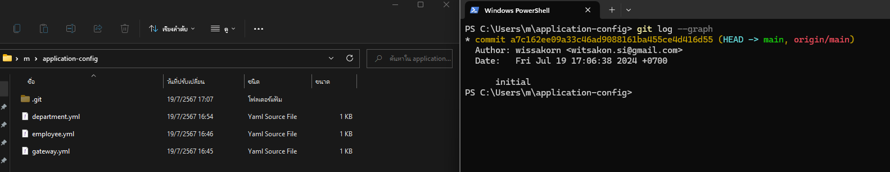

# Note
### Setting _application-config_ on Local
- Initial git use `git init` and `git commit` in folder application-config
```
...
  cloud:
    config:
      server:
        git:
          uri: file://${user.home}/application-config
...
```

